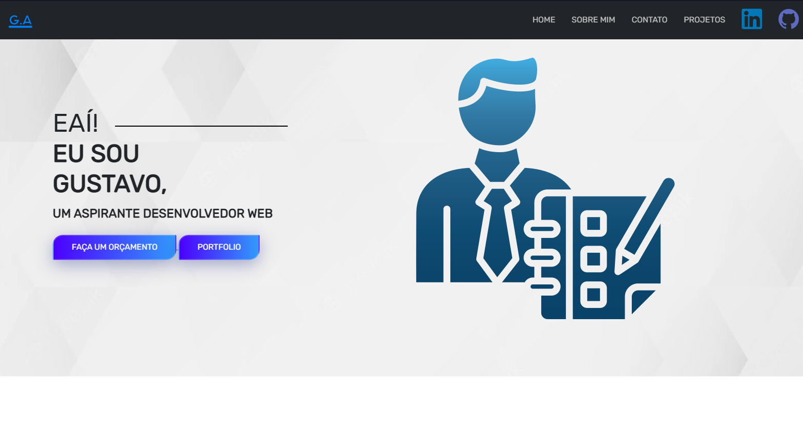

<h1 align="center"> Portfólio </h1>

Desenvolvi este site para treinar minhas habilidades com programação WEB, e principalmente para conhecer os fundamentos de Bootstrap. 

Conforme eu for realizando novos projetos, irei atualizar a seção de projetos, aguarde! 

  <a href="#-tecnologias">Tecnologias</a>&nbsp;&nbsp;&nbsp;|&nbsp;&nbsp;&nbsp;
  <a href="#-projeto">Projeto</a>

  

 

  

## 🚀 Tecnologias

Esse projeto foi desenvolvido com as seguintes tecnologias:

- HTML e CSS
- Bootstrap
- JavaScript
- Git e Github

## 💻 Projeto

Site desenvolvido para atualizar meu portfolio.

- [Visite o projeto online](https://gustavoabarbosa.github.io/MyPortfolio/)

---
